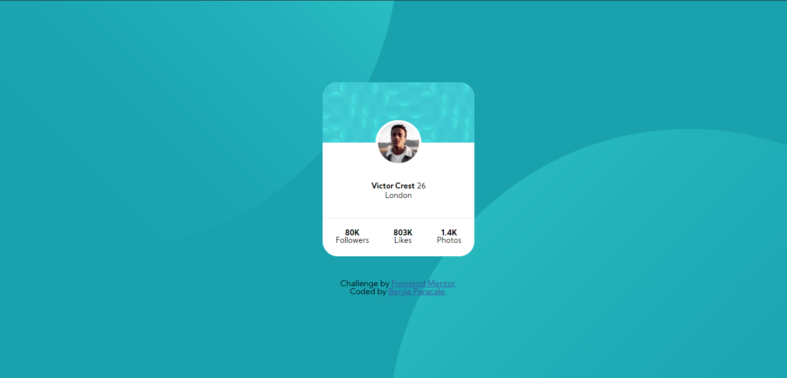

# Frontend Mentor - Profile card component solution

This is a solution to the [Profile card component challenge on Frontend Mentor](https://www.frontendmentor.io/challenges/profile-card-component-cfArpWshJ). Frontend Mentor challenges help you improve your coding skills by building realistic projects. 

## Table of contents

- [Overview](#overview)
  - [The challenge](#the-challenge)
  - [Screenshot](#screenshot)
  - [Links](#links)
- [My process](#my-process)
  - [Built with](#built-with)
  - [What I learned](#what-i-learned)
  - [Continued development](#continued-development)
  - [Useful resources](#useful-resources)
- [Author](#author)
- [Acknowledgments](#acknowledgments)

## Overview

### The challenge

- Build out the project to the designs provided

### Screenshot



### Links

- Solution URL: [Add solution URL here](https://your-solution-url.com)
- Live Site URL: [Add live site URL here](https://your-live-site-url.com)

## My process

### Built with

- Semantic HTML5 markup
- CSS custom properties
- Flexbox
- CSS Media Queries
- Mobile-first workflow (iPhone X to Macbook 13")

### What I learned

Proud of this Semantic HTML:

```html
  <main>
     <header>
       <picture>
         
       </picture>
     </header>
     <figcaption>
       <strong>Victor Crest</strong> 26
       <br>
       London
     </figcaption>

      
      <section>
        <dl>
          <dt>80K</dt>
          <dd>Followers</dd>
        </dl>
        <dl>
          <dt>803K</dt>
         <dd>Likes<dd>
        </dl>
        <dl>
          <dt>1.4K</dt>
          <dd>Photos</dd>
        </dl>
      </section>
   </main>
```

Proud of this CSS Media Queries:

```css
@media (min-width: 376px) and (max-width: 1439px) {
    body {
        background-position: top -700px left -300px, bottom -650px right -300px;
        background-size: 1050px;
    }
}

@media (min-width: 1440px) {

    body {
        background-position: top -700px left -400px, bottom -700px right -380px;
        background-size: 1200px;
    }

    main {
       max-width: 100%;
       height: fit-content;
       font-size: .95em;
    }


    section {
        font-size: 1em;
    }
}

@media (max-width: 320px) {
    
    body {
        background-position: top -260px left -360px, bottom -260px right -360px;
        background-size: 500px;

    }

    main {
       max-width: 100%;
       max-height: fit-content;
       font-size: .85em;
    }


    section {
        font-size: 1em;
    }

    footer {
        font-size: .85em;
    }
}
```

### Continued development

My CSS Media Queries here isn't perfect whenever I toogle to the non-standard devices my backgroun-image isn't responsiv. I do some readings and I found out you can use JavaScript to make this thing right, bnut I'm far from good to JavaScript so I will just live the link [here](https://css-tricks.com/perfect-full-page-background-image/) for future purposes.

**Note: Delete this note and the content within this section and replace with your own plans for continued development.**

### Useful resources

- [CSS Tricks for Media Queries for the Standard Devices](https://css-tricks.com/snippets/css/media-queries-for-standard-devices/) - This helped me for the CSS Media Queries.
- [MDN Web Docs CSS Media Queries](https://developer.mozilla.org/en-US/docs/Web/CSS/Media_Queries/Using_media_queries) - This is a very helpful concept.


## Author
- Frontend Mentor - [@BenjZP](https://www.frontendmentor.io/profile/BenjZP)
- Twitter - [@heybenjjj](https://www.twitter.com/heybenjjj)

## Acknowledgments

Great thanks to [CSS Tricks](https://css-tricks.com/) website for a ton of CSS ideas and resources, the website help me a lot.

